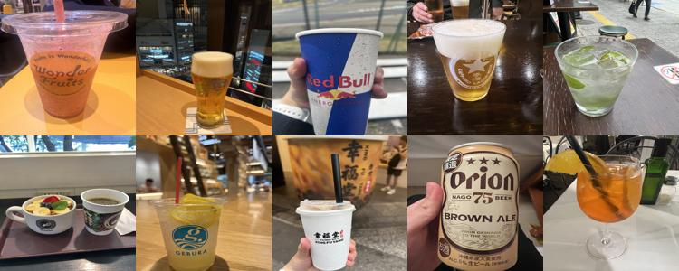

# Image Search with Raidillon

This project demonstrates how to use the Raidillon library for image search. The project uses Python 3.11 and `pkg_resources` to manage dependencies. The image search is performed using the IVF-Flat index with Euclidean distance.

## Prerequisites
- Python 3.11
- Required Python packages (listed in `requirements.txt`)


## Setup

1. **Install Python 3.11**:
   Ensure you have Python 3.11 installed on your system.

2. **Create a virtual environment**:
   ```sh
   python3.11 -m venv myenv
   source myenv/bin/activate
   ```

3. **Install dependencies**:
    ```
    pip install -r requirements.txt
    ```

4. **Build the Raidillon library**:
    ```
    cd ../../..
    mkdir build
    cd build
    cmake ..
    make
    cd ../bindings/python
    python setup.py install
    cd examples/python/image_search
    ```

## Usage
1. **Prepare the data**:
    - Place the images to be searched in the `../data/data` directory.
    - Place the query images in the `../data/query` directory.

2. **Run the image search**:
    ```
    python IVFFlat.py
    ```
3. **View the results**: 
    The results will be saved in the results directory. Each query image will have a corresponding result image showing the top matches.

## Example Result
Here are some example results:
### Query Image 1

### Search Result 1

### Query Image 2

### Search Result 2

### Query Image 3

### Search Result 3

